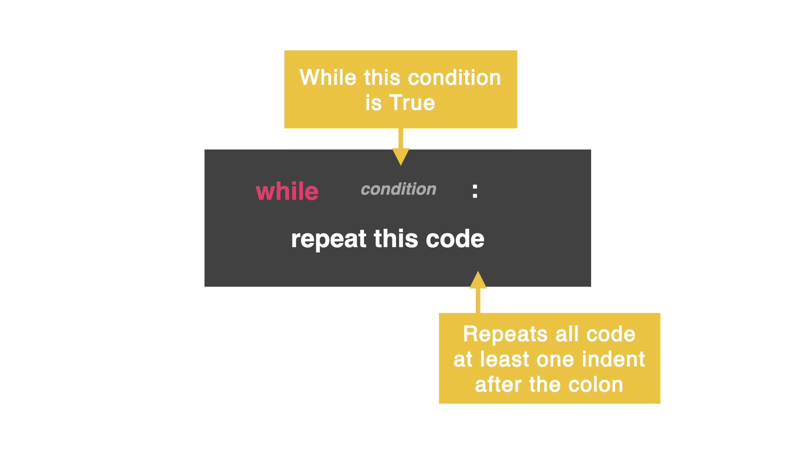

# All About Loops

### While Loop
A while loop allows your code to repeat itself based on a condition you set.

It is similar to an if statement in that you ask a question, and as long as the answer is true, the computer will repeatedly run the code.



In the code below, the variable is called counter and starts at zero. The while loop has the condition saying, "while the counter is less than ten do this..."

In this case, print the variable and then add +=1 to that variable. As long as variable is less than 10, the loop will repeat the code.

```PY
counter = 0
while counter < 10:
  print(counter)
  counter +=1
  ```

# Day 15 Challenge

Write a program that loops. Inside the loop, ask the user what animal sound they want to hear.

### Example
```PY
What animal do you want?: Cow
A cow goes moo.
Do you want to exit?: no
What animal do you want?: A Lesser Spotted lemur
Ummm...the Lesser Spotter Lemur goes awooga.
Do you want to exit?: yes
```