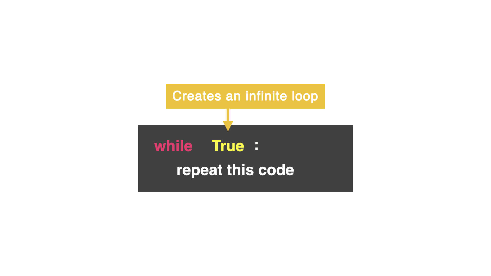

# while True Loop
On Day 15, you learned how to create a while loop. However, there are a lot of moving parts that can turn the while loop into an accidental infinite loop...and a nightmare.

## Introducing the while True loop...


👉Let's try it out.
What do you think the below code does?

Remember you can use the big Stop button on the top if your program does not end.
```py
while True:
  print("This program is running")
print("Aww, I was having a good time 😭")
```
#### This type of loop only has two conditions: True and False. Make note of the capital "T" and "F".

In this loop, I am saying to the computer:

"while True is True...do this over and over again."

Yes, we made an infinite loop, but hold on...

# Day 16 Challenge

Create a "Name the Lyrics" game. Write your favorite song lyrics with a word or two missing. The user has to figure out the correct song lyric in as few attempts as possible. Find the true lyric master among you!

### Example
```py
'''Fill in the blank lyrics!
(Type in the blank lyrics and see if you are as cool as me.)
Never going to ______ you up.
put
Nope, try again.
Never going to ______ you up.
let
Nope, try again.
Never going to ______ you up.
give
Well done! It only took you 3 attempts.
```