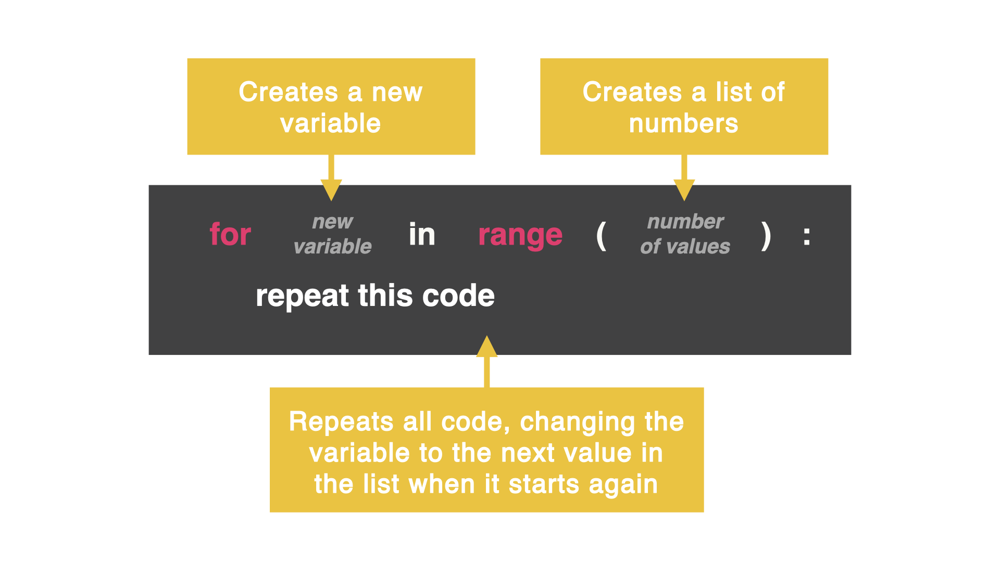

# For Loop
A while loop is perfect to use when we don't know how many times we want the loop to repeat.

If we have an idea of how many times we want the loop to repeat, we can use a for loop to loop code in exactly the same way the while loop did.

However, we can set up the variable, control condition, and increment all in ONE line of code.



### Let's compare
Here is how we created a counter with a while loop:
```py
counter = 0
while counter < 10:
  print(counter)
  counter += 1
  ```
And here is the same counter using a for loop:

```py
for counter in range(10):
  print(counter)
  ```
# Day 19 Challenge

A common thing people do is borrow money. When people repay money, they pay interest which is paid back annually and added to the original amount the person borrowed.

You are going to create a loan calculator that shows how much money you owe for a loan of $1,000 with a 5% APR (APR is fancy for Annual Percentage Rate) over 10 years.

This means each year the amount of money you owe will increase 5%.

Figure out how much you owe altogether for 10 years?

Use a for loop and one or two lines of looped code to determine the answer. (Hint: Don't make this overcomplicated. It should only be a few lines of code altogether.)

