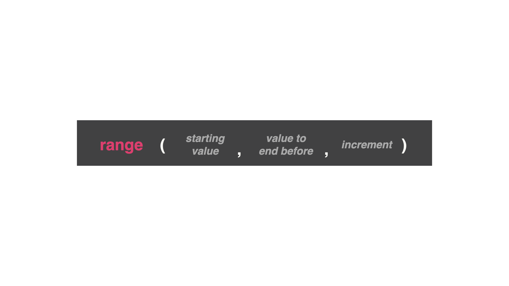

# What can range really do?

Give range one number, and it will count up to that number. However, you can actually give the range function a few options...

- starting value: what number do you want to start with?
- ending value: the number after the number you want to end with (example: if you type 10 as the ending value, the computer will count until 9)
- increment: How much should it increase by every time it loops? (example: Do you want to count by 1s, 5s, 10s?)

The ending value has an unsaid 'less than'. Meaning the computer will stop one number before the ending number that is written in the range.

# Day 20 Challenge
### List Generator
Ask the user to list a starting number, ending number, and increment to use. Display an answer based on the users' answers (use the input command.)

#### Example:
```PY
Start at: 200
End before: 300
Increment between values: 20
200
220
240
260
280
```