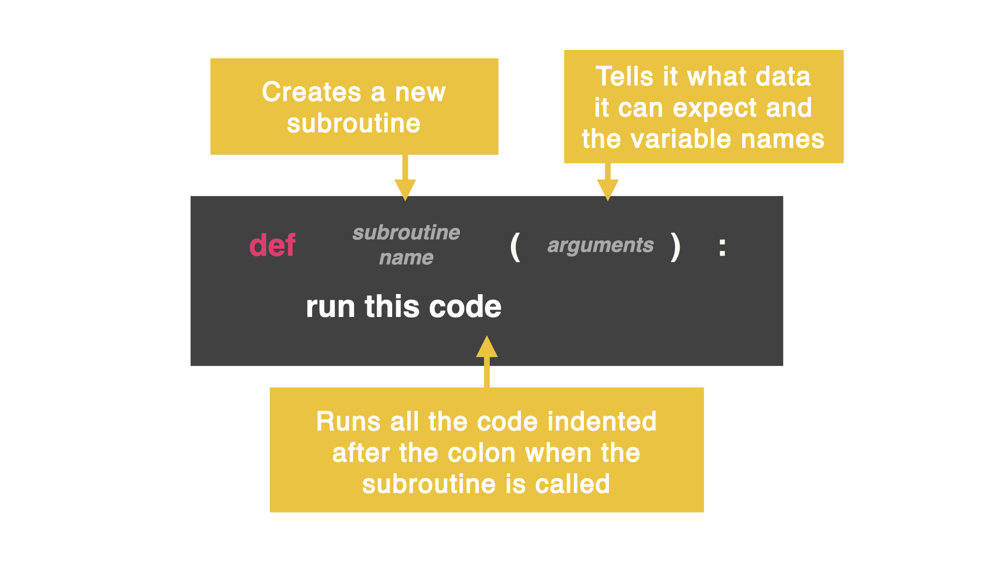

# Parameters
I get it. So far, subroutines have been a bit underwhelming...

Let's put those subroutines to better use by sending them information using parameters and making them do different things based on different inputs.

If you change the ingredients in a recipe, you get a different kind of cake. Let's do that with subroutines.

In a subroutine, the () are for the argument (FYI argument is another word for parameter). These are the pieces of information we pass to the code. These can be variable names that are made up for the first time within the argument ().



Here is a simple subroutine that uses the argument to take in the name of an ingredient and expresses its opinion (quite strongly) about the ingredient that the user typed. For example, 'chocolate' is amazing, but 'broccoli'...not so much.

# 👉 Day 24 Challenge
Let's build an infinity dice!

Create subroutines that will roll a dice with any number of sides (essentially as big of a number as you like). Write one subroutine with one parameter that allows us to call a function (such as rollDice).

```
Example:
Infinity Dice 🎲
How many sides?: 600
You rolled 532
Roll again? yes
You rolled 102
Roll again? no
```