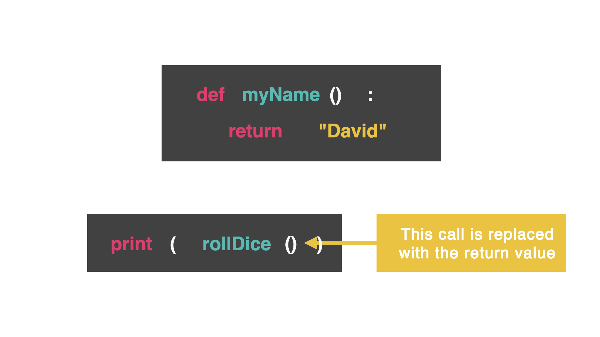

# Return Command
Let's go deeper into subroutines. Can they send information back to the main part of the program?

Let's do this with the return command.



The return command sends some information back to the part of the code that called it. This means the function call is replaced with whatever was returned.

We saw this before with importing libraries and random numbers. We could use the random number wherever we wanted.

## Pin Picker
This subroutine creates a random pin number for us. This subroutine (called pinPicker) has the parameter called number (how many numbers I want to have in this pin). Then, there is a string (called pin) that is empty and a for loop that is used to create a defined amount of random numbers. The variable number controls how many times the loop will add the new number to the pin. This is done through += and concatenating new values. We will cast the random number as a string so it can be concatenated together.

Then...the magic...we return the pin.

👉 Let's see what happens:
```py
#subroutine has parameter called `number`
#`number` shows how many numbers we want the pin to have
def pinPicker(number):
  import random
  pin = "" #this is the empty string
  for i in range(number): #for loop shows defined amount of random numbers
    pin += str(random.randint(0,9)) #we want a string of random numbers between 0-9
  return pin
pinPicker(4) #4 means we want 4 random numbers
```
## Nothing happens? Why?
The line pinPicker(4) that calls for a 4 digit pin is being replaced by a 4 digit pin. (That's great, but I don't see that happening...)

We are not telling the computer to do anything with the string that was created. How do we make the string appear?

With print of course!

👉 Let's assign a variable to pinPicker:
```py
myPin = pinPicker(4)
```
👉 Now print it out:
```py
print(myPin)
```

# 👉 Day 25 Challenge
Let's extend Day 24's project and create a health stats generator for a character in a video game.

Create a subroutine that rolls a dice of any size and returns that number.
Then, create a second subroutine that rolls one six-sided dice and one eight-sided dice.
Multiply the number from the six-sided dice and eight-sided dice together and return that subroutine as a character's health stats for a video game.
Print out the character's health stats.
Add a loop to give the user the option to generate health stats for another character.
(We genuinely see this in video games!)

🥳 Extra points if you ask for the character's name and double extra points if you use different colors!
```
⚔️ Character Stats Generator ⚔️

Name your warrior: Agnes
Their health is: 20hp

Name your warrior: Ian
Their health is: 6hp

Name your warrior: Penelope
Their health is: 48hp
```