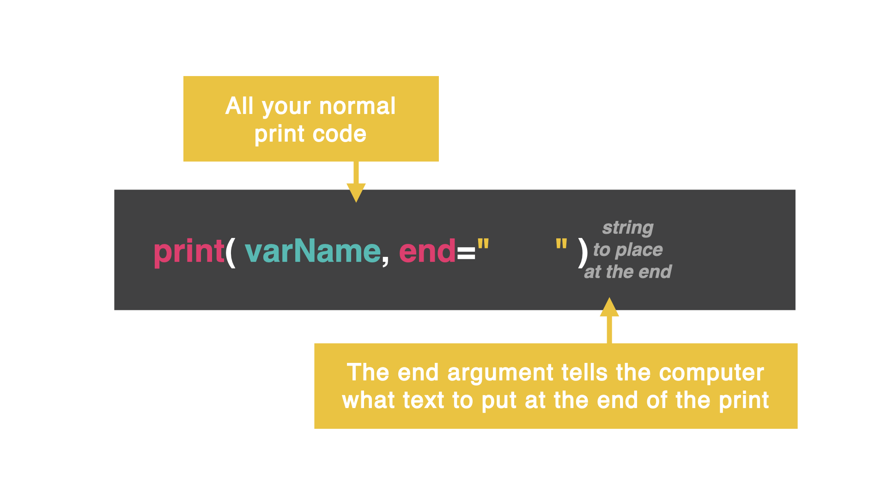
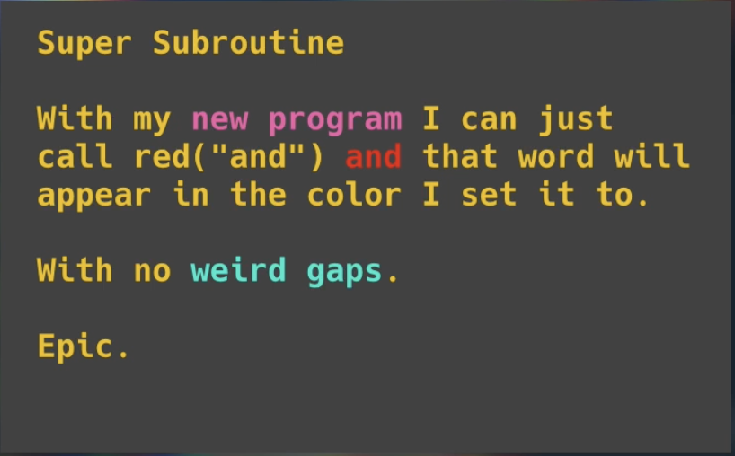

# The Secrets of `print`

## Secret One: end

You can already create print statements like a boss, but there are a few things you can do to make them easier.

Let's add a few secret second arguments to the print statement and see what happens.

By default, at the end of every print statement, the computer clicks 'enter'.

👉 Remember, how a range of numbers shows each number on a new line...

```py
for i in range(0, 100):
print(i)
```



### Add a space

👉 Let's tweak that code and see if we can get it to print with a space between each number instead of a new line. What do you notice?

```py
for i in range(0, 100):
print(i, end=" ")
```

### Add a space and comma

👉 What if we want to add a comma and a space? Let's try it by adding , to our argument.

```py
for i in range(0, 100):
print(i, end=", ")
```

Now this looks like a proper list!

### Add a new line, tab, or vertical tab

👉 What happens if you add these different options in your second argument? Play around with these options below and see what they do:

```py
#new line
for i in range(0, 100):
print(i, end="\n")
```

```py
#tab indent
for i in range(0, 100):
print(i, end="\t")
```

```py
#vertical tab
for i in range(0, 100):
print(i, end="\v")
```

Play around with `end`. What can it do?

## Secret Two: sep

(Wait...why are we still using end when this chapter is about secret two, sep? Just hold tight...)

### Color Changing with end...

👉 I can turn the colors on and off different bits of the code by using end. Remove the previous code from your main.py file and try this out.

```py
print("If you put")
print("\033[33m", end="") #yellow
print("nothing as the")
print("\033[35m", end="") #purple
print("end character")
print("\033[32m", end="") #green
print("then you don't")
print("\033[0m", end="") #default
print("get odd gaps")
```

👉 Let's concatenate that same print statement:

```py
print("If you put", "\033[33m", "nothing as the", "\033[35m", "end character", "\033[32m", "then you don't", "\033[0m", "get odd gaps", end="")
```

Now you may notice that we are getting weird double spaces in between the different sections. Let's fix that!

### Color changing with sep...

👉 Take this same code and change end to sep (short for separator) and add a space at the end of each string. What happens?

```py
print("If you put ", "\033[33m", "nothing as the ", "\033[35m", "end character ", "\033[32m", "then you don't ", "\033[0m", "get odd gaps ", sep="")
```


This is a much easier way to control spacing in random text or emojis too!

## Secret Three: Cursor

David, you muppet! Why are we doing this again? We already learned this...

👉 Do you notice how difficult this is to read?

```py
import os
for i in range(1, 101):
print(i)
os.system("clear")
```

Your probably thinking...David, `import time`:

👉 Let's do it, but is there anything you still notice?

```py
import os, time
for i in range(1, 101):
print(i)
time.sleep(0.5)
os.system("clear")
```

### That GIANT white cursor...

I bet you didn't even know we could turn that off! It is just a sneaky print command.


👉 Let's try the same code, but turn the cursor off:

```py
import os, time
print('\033[?25l', end="")
for i in range(1, 101):
print(i)
time.sleep(0.2)
os.system("clear")
```

What if we want to turn the cursor back on:


# 👉 Day 29 Challenge

- Write a subroutine that writes text in color. All it will do is print out the text in that color and turn the color back to normal when it's finished.

- Control end and sep so there are not random symbols or spaces.

- Check out this github resource for the color codes.

Example:


