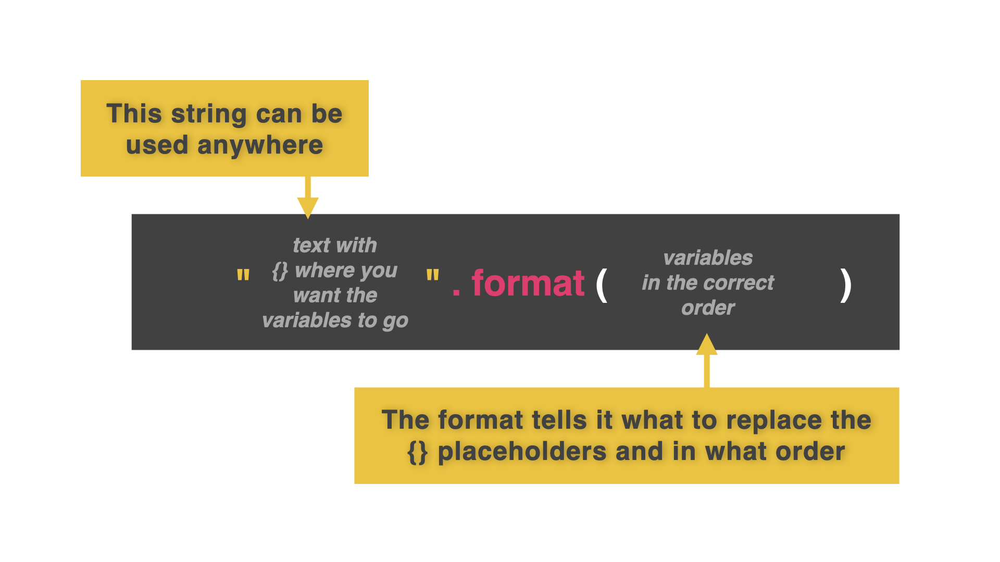
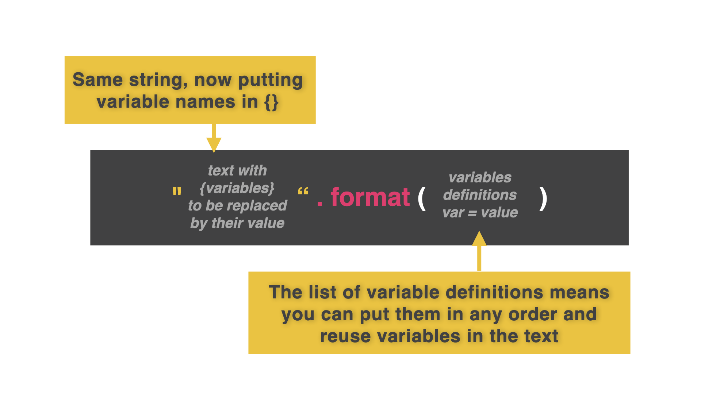
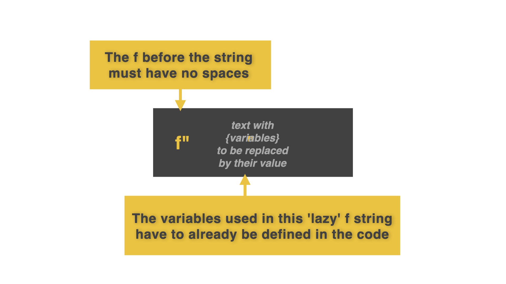
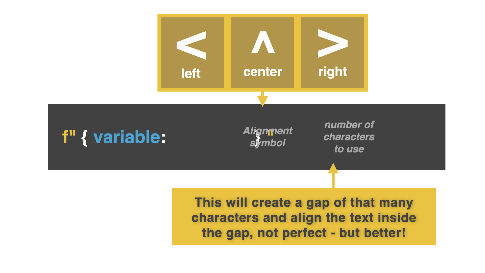

# 👉 Day 30 Challenge

Create a program that uses a loop that asks the user what they have thought of each of the 30 days of challenges so far.

For each day, prompt the user to answer a question and restate it in a full sentence that is center aligned underneath the heading.

Example:

```
30 Days Down
Day 1:
Amazing
You thought Day 1 was amazing.
Day 2:
so good that I bought the David plushie
You thought Day 2 was so good...
```

# f-strings

f-strings (format strings) are the best way to combine variables and text together. Everything up until now has been...well...awkward.

👉 Let's look at how we have combined variables and text in the past...concatenating.

```py
name = "Katie"
age = "28"
pronouns = "she/her"

print("This is", name, "using", pronouns, "pronouns and is age", age)
```

👉 Let's now use an f-string for this same code. What changes did I make to this code?

```py
name = "Katie"
age = "28"
pronouns = "she/her"
print("This is {}, using {} pronouns, and is {} years old.".format(name, pronouns, age))
```

Change 1: Using `{}` as a placeholder for the variable. Change 2: Adding `.format(variable names, commas)`


# Local Variables

We can set local variables within the f-string itself. Now it doesn't matter the order of the variables.

👉 Looking at this code again, I can set my variables inside the text itself. Watch this:

```py
name = "Katie"
age = "28"
pronouns = "she/her"
print("This is {name}, using {pronouns} pronouns, and is {age} years old. Hello, {name}. How are you? Have you been having a great {age} years so far".format(name=name, pronouns=pronouns, age=age))
```

Change 1: Replace `{}`with variable names. Change 2: Replace each variable inside `{}` with what has been defined in `format.( = )`



f-strings work with different variable types too: `int`, `float`, and `string`.

👉 We can assign concatenated sentences to variables. Watch this. We made a variable called response and made it equal to a concatenated sentence. Now I can use this response easily wherever I want.

```py
name = "Katie"
age = "28"
pronouns = "she/her"
response = "This is {name}, using {pronouns} pronouns, and is {age} years old. Hello, {name}. How are you? Have you been having a great {age} years so far".format(name=name, pronouns=pronouns, age=age)
print(response)
```

# The Power of f...

Instead of all that faffing about...try this instead.

Use the letter `f` before any string with `{}` for variable names (and forget that `.format` business).

👉 Look at this same code and see the difference using this technique:

```py
name = "Katie"
age = "28"
pronouns = "she/her"
response = f"This is {name}, using {pronouns} pronouns, and is {age} years old. Hello, {name}. How are you? Have you been having a great {age} years so far"
print(response)
```

# Alignment


left = `<`, right = `>`, center = `^`

👉 This program shows how much of 100 Days of Code we have completed so far. I want this to look like a list. However, once we get to day 10, it starts to look a bit messy. Make sure you include `f` when using alignment.

```py
for i in range(1, 31):
print(f"Day {i} of 30")
```

👉 Let's fix it by adding a left alignment of 2 characters long.

```py
for i in range(1, 31):
print(f"Day {i: <2} of 30")
```
