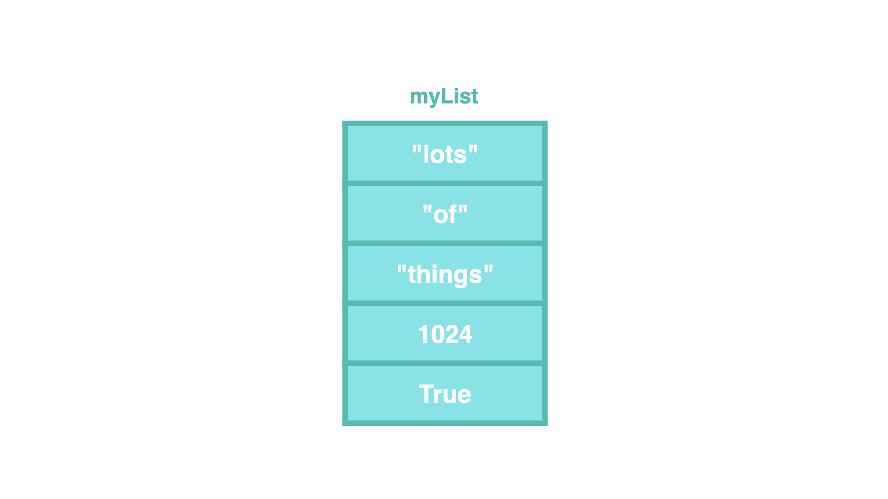
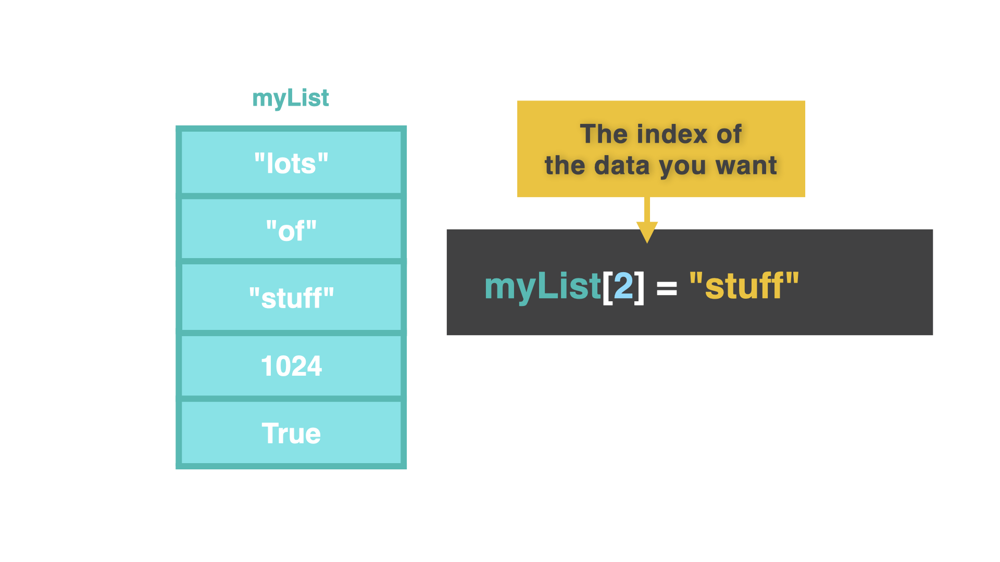
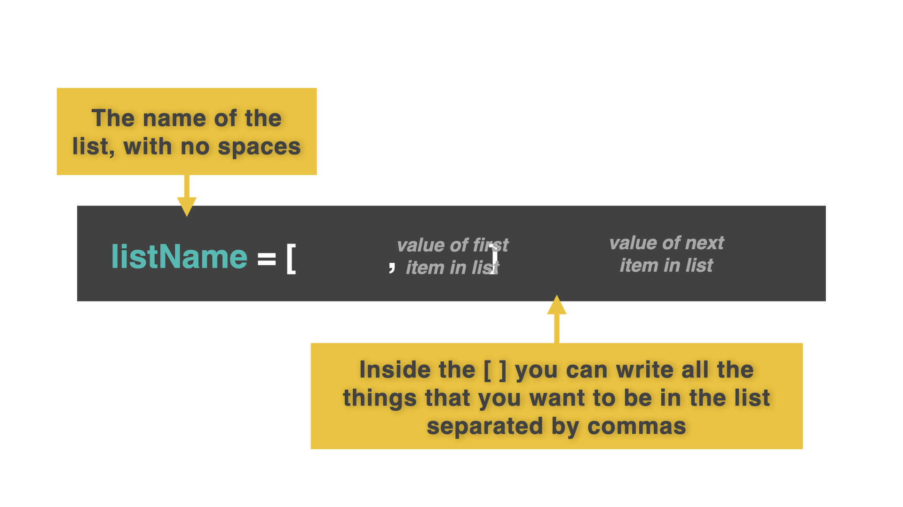
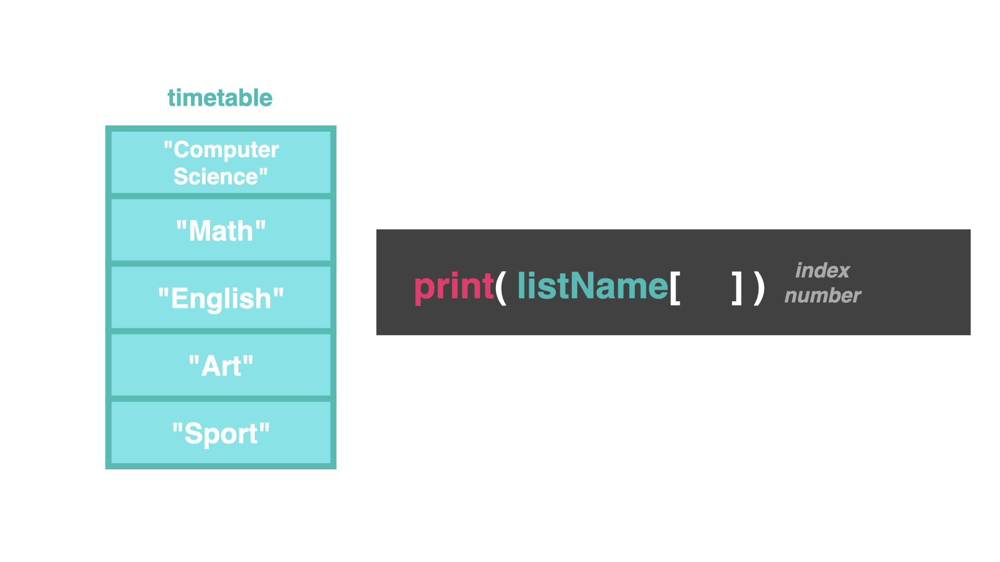
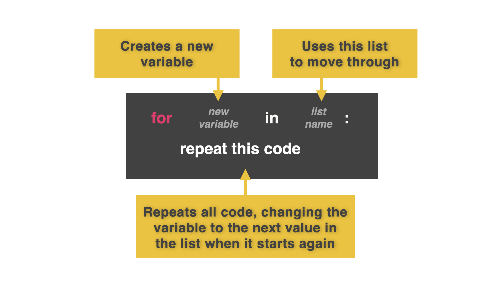

# Lists

In Computer Science, we learn about a data structure called arrays. Arrays are a place to store more than one thing with the same variable name.

However, Python uses lists instead. Lists are literally lists of items. Any piece of data from any data type can go into a list. We can extract, remove, or change lists.

You may be asking: "What is the point of a list?"

Sometimes, you don't always know how much data you need to store. We can use a loop to move through data in a list without having to first manually tell the computer how many things are in that list.

## Starting at 0

As far as Python is concerned, this is a list. Notice we start counting the first item at 0 (instead of 1).

Example: In this list, "lots" is index 0, "of" is index 1, etc.

We can directly add to the list with the variable name, `[ ]` with the index number of the row.


## Printing Lists

We can print out data in the same way.

👉 Let's make a list of our class schedule.

```py
timetable = ["Computer Science", "Math", "English", "Art", "Sport"]
```

👉 Let's print our list:

```py
timetable = ["Computer Science", "Math", "English", "Art", "Sport"]
print(timetable)
```

## Yikes!

That looks awful with all the `[ ],""` printing too! If I want to print out index 1 in my timetable, I need to tell the computer!

👉 Let's try to `print` math from our list above:

```py
timetable = ["Computer Science", "Math", "English", "Art", "Sport"]
print(timetable[1])
```

Remember, we start counting at 0. So the second index, math, is 1.

# Changing Lists

We can also change lists and the index.

We built our list with `timetable =`, but we want to change index 4, "sport". We can do this by calling it with [ ].

```py
timetable = ["Computer Science", "Math", "English", "Art", "Sport"]
print(timetable[0])
print(timetable[1])
print(timetable[2])
print(timetable[3])
print(timetable[4])
```

👉 Add this to to the code above:

```py
timetable[4]= "Watch TV"
```

Why is it not printing correctly? I have created the timetable, printed it out, and changed index 4 of the timetable.

👉 However, I need to `print` the changed version. Let's `print` our new index:

```py
timetable[4]= "Watch TV"
print(timetable[0])
print(timetable[1])
print(timetable[2])
print(timetable[3])
print(timetable[4])
```

# Lists and Loops

Why would I want to write all of those lines of code?

## Introducing lists' best friend...loops


👉 We can replace a lot of those lines of code we just wrote with just two lines of code. Change your code to look like this:

```py
timetable = ["Computer Science", "Math", "English", "Art", "Watch TV"]
for lesson in timetable:
print(lesson)
```

Now we have given the computer a list. We said "make lesson each value within this list and then do something with it."

# 👉 Day 32 Challenge

Create a list that stores greetings in different languages. Start with the language you speak.
Then, go on the internet to find other greetings in other languages. Here is a list of greetings to get you started.
Import `random` library. Generate a random number between 0 and maximum number of items in your list.
At random, when the user clicks run, `print` one of the greetings.
Use an f-string.
