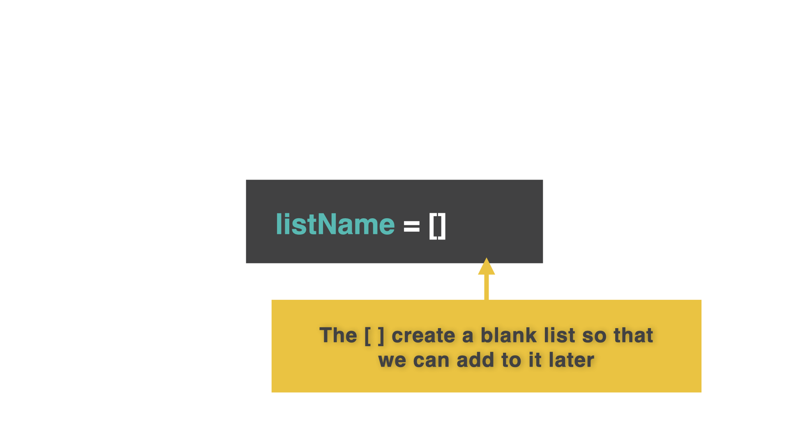
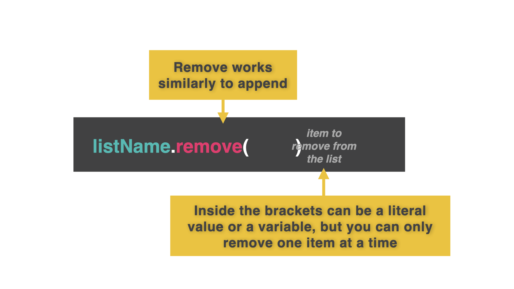

# 👉 Day 33 Challenge

Create your own to do list manager. (This can be super useful!)

- Ask the user whether they want to view, add, or edit their to do list.
- If they want to view it, print it out in a nice way (Hint: subroutine).
- If they choose to add an item to the to do list, allow them to type in the item and then add it to the bottom of the list.
- If they want to edit the to do list, ask them which item they completed, and remove it from the list.
- Don't worry about duplicates!
- The first item you put in the list should be the first item you remove.
- Add a title, some color, alignment to the text, or emojis. Show off your skills!

Example:

```
To Do List Manager:
Do you want to view, add, or edit your to do list?
view
Record video for day 34
```

# Dynamic Lists

Dynamic lists are ways of using a blank list and adding or removing items to it as we go.

## Blank lists

👉 Let's make an agenda for today. I am not going to put anything in this list (yet). Behind the scenes, the computer is going to recognize this code as a blank list.

```py
myAgenda = []
```



## Append a list

`.append` will let us add whatever is in `()` to the list.

👉 Let's use a `while True` loop to add items to the list. We will store this in a variable called `item`. Add this code to the end of the code above:

```py
while True:
item = input("What's next on the Agenda?: ")
myAgenda.append(item)
printList()
```

👉 What is next on your agenda? Type it in the console.

## Printing our new list

👉 Wait?! Why can't we see what we just added to the list? We need to `print` the list each time to see what has changed. Let's use a subroutine (why not!):

```py
myAgenda = []
def printList():
print() #this is just to add an extra space between items
for item in myAgenda:
print(item)
print() #this is just to add an extra space between items
while True:
item = input("What's next on the Agenda?: ")
myAgenda.append(item)
printList()
#The comments in green are for you and the computer will skip them.
```

Do you see how the subroutine allows you to add a new item to your agenda and prints the entire list each time?

You could even import `os` and `sleep` libraries to pause and clear your code to make this dyanmic list look even nicer.

Remember: The list that's blank needs to be listed first...even before the subroutines.

# Removing Items from a List

👉 Let's make a few changes to our list. We want to ask the user if they want to add or remove an item from their list:

```py
myAgenda = []
def printList():
  print()
  for item in myAgenda:
    print(item)
  print()
while True:
  menu = input("add or remove?: ")
  if menu == "add":
    item = input("What's next on the Agenda?: ")
    myAgenda.append(item)
  elif menu == "remove":
    item = input("What do you want to remove?: ")
    myAgenda.remove(item)
  printList()
```

Notice how using `.remove` will remove what is inside the `( )`.

