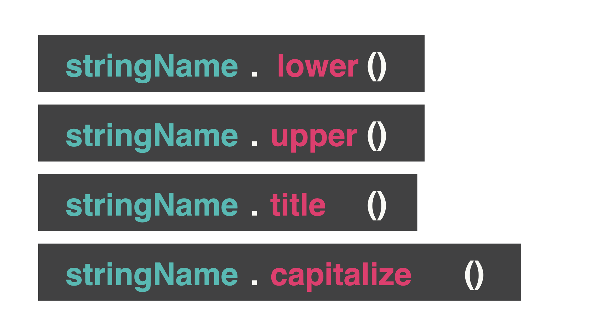

👉 Day 36 Challenge

- Create a list of people's names. Ask for first and last name (surname) separately.
- Strip any extra spaces.
- Store names in a capitalized version.
- Create a new string using an fString that combines the tidied up version of the first name and tidied up version of the last name.
- Add those new versions to a list.
- Do not allow duplicates.
- Each time you add a new name, you should print out the full list.

# String Manipulation

Let's do some string manipulation to make if statements even easier.

👉 Does this code look familiar from the insult generator project?

```py
name = input("What's your name? ")
if name == "David" or name == "david":
print("Hello Baldy!")
else:
print("What a beautiful head of hair!")
```

Right now, if the user writes "DAVID" or "david", the `if` statement works correctly. However, "DaVID" does not give the correct output.

To the computer, " david", "dAviD", and "david" are completely different.

To simplify what the user typed in, we can add these functions to the end of the name of the variable:


- `.lower` = all letters are lower case
- `.upper` = all letters are upper case
- `.title` = capital letter for the first letter of every word
- `.capitalize` = capital letter for the first letter of only the first word

## lower

👉 The computer is converting everything to lowercase before it compares my `if` statements.

You need to type your `if` statement in lower case when you use `.lower`. The `if` statement needs to be written in upper case when you use `.upper`, etc.

```py
name = input("What's your name? ")
if name.lower() == "david":
print("Hello Baldy!")
else:
print("What a beautiful head of hair!")
```

### What if we put a space first?

Adding `.strip()` removes any spaces on either side of the word.

👉 We can chain these functions together.

```py
name = input("What's your name? ")
if name.lower().strip() == "david":
print("Hello Baldy!")
else:
print("What a beautiful head of hair!")
```

# No Duplicates

This is a simple program that creates a list with a simple subroutine. In the `while True` loop, the user is adding something to the list. (This is nowhere near as complicated as what you have done).

👉 What happens when you `run` this code and add 'phone' and 'Phone' to your list? Does it create duplicates?

```py
myList = []
def printList():
print()
for i in myList:
print(i)
print()
while True:
addItem = input("Item > ")
if addItem not in myList:
myList.append(addItem)
printList()
```

👉 Here is an easier way to ensure you do not have duplicates. Use these various string manipulations in your loop:

```py
myList = []
def printList():
print()
for i in myList:
print(i)
print()
while True:
addItem = input("Item > ").capitalize().strip()
if addItem not in myList:
myList.append(addItem)
printList()
```
