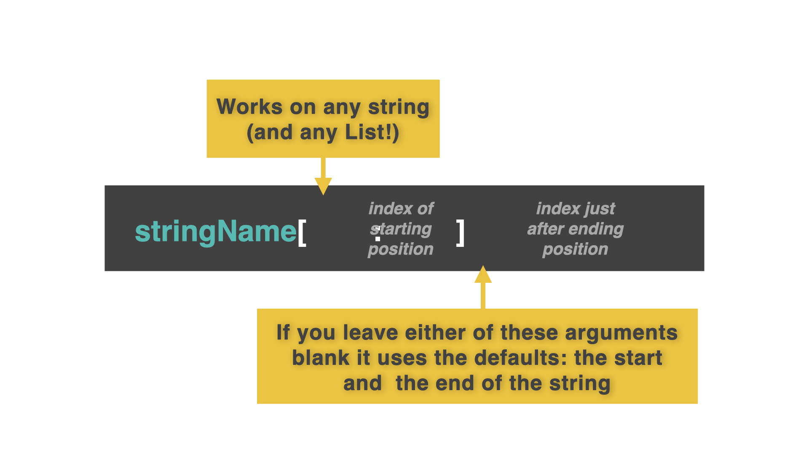

# 👉 Day 37 Challenge

This is the challenge you're looking for. This program will generate your Star Wars Name.

- Ask the user to input their first & last names.
- Slice the first 3 letters of the first name.
- Slice the first 3 letters of the last name (surname).
- Join them together. Ideally change the case so that it looks good - think fStrings or .upper()/.lower(). This is the user's Star Wars first name.
- Now ask the user for their mother's maiden name and the city where they were born. (Maiden name is the last name they had before they got married. If you are not sure, make up a last name.)
- Combine the first two letters of the maiden name with the last 3 letters of the city to make the user's Star Wars last name. Remember, fStrings and .upper()/.lower().
- Finally, print them both as part of a sentence.
  🥳 Extra points for getting all the inputs with just one input command and the split function.

Example:

```
🌟Star Wars Name Generator🌟
Input your first name > David
Input your lastname > Morgan
Input your mother's maiden name > Jones
Input the city where you were born > Cardiff
Your Star Wars name is Davmor Joiff
```

# String Slicing

Aren't strings brilliant? Yes, yes they are.

However, sometimes we might want to take part of a string to use it somewhere else. Sometimes, we might want to look at just the first letter of a string or chop it into chunks.

To do this, we use string slicing.

A string isn't just one big lump of text. In fact it's a list of individual characters. This means that we can use indexing just like we did with lists waaay back on Day 32.

By giving our program an index, we can specify which part of the string to chop out. 🪓🪓

Pssst... When you see '#' followed by green text, these are comments for you. The computer will ignore it.

## Slicing

To slice a single character from a string, you use the index of that character in square brackets [] just like you'd use with a list! Gasp!

👉 Let's see what happens:

```py
myString = "Hello there my friend."
print(myString[0])

# This code outputs the 'H' from 'Hello'
```

To slice more than one character, you use two indices (yes that is the plural form of 'index'): the start character and one after your desired end character.


👉 Let's try it:

```py
myString = "Hello there my friend."
print(myString[6:11])

# This code outputs 'there'.
```

👉 Leaving the first index blank defaults to 'start from index 0'.

```py
myString = "Hello there my friend."
print(myString[:11])

# This code outputs 'Hello there'.
```

👉 Leaving the last index blank defaults to 'go to the end'.

```py
myString = "Hello there my friend."
print(myString[12:])

# This code outputs 'my friend.'.
```

# Split

👉 split lets us split a string into a list of individual words by separating it at the space characters.

```py
myString = "Hello there my friend."
print(myString.split())
#This code outputs ['Hello', 'there', 'my', 'friend.']
```
