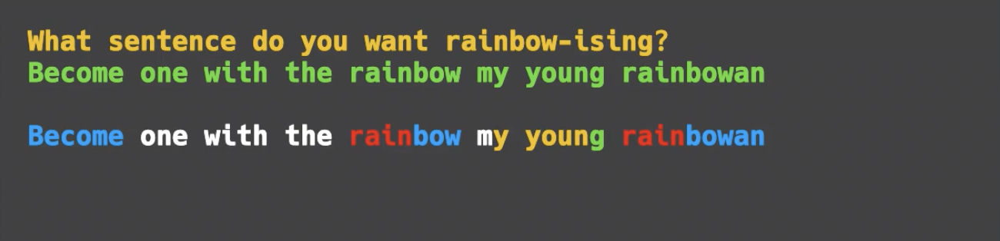

# 👉 Day 38 Challenge

Code the rainbow!

1. Ask the user to input any sentence (string).
2. Now we'll rainbow-ize (nope, me neither) it.
3. As soon as the string contains an 'r', every letter from that point on should be red.
4. When the computer encounters a 'b', 'g', 'p' or 'y', from there the output should be blue for 'b', green for 'g'...you get the idea.
5. Loop through the string and output it (so the color continues through the loop).
6. The output should change color every time it encounters a new r,g,b,p or y.

🥳 Extra points for resetting the output color back to default every time there's a space.

Example:


# Strings and Loops

Now that we know that strings are basically lists in disguise, we can start to harness the power of loops with them.

Let's look a bit further into string slicing.

## Using a for loop

👉 This `for` loop creates a variable called letter. It is used to store each character in the string as the loop goes through it, starting at the first character.

The `print` statement uses the letter variable and will output the string one character at a time (like a list).

```py
myString = "Day 38"
for letter in myString:
print(letter)

# This code outputs:

#D
#a
#y
#3
#8

# this is a comment in the code, the computer will ignore it
```

This means that we can do certain things to certain characters inside the loop.

## if statement inside the loop

👉 This code will examine the lower case version of each character. If it's an 'a', the computer will change the font color to yellow before printing.

Outside of the loop, the last line sets the font color back to default for the next character in the loop.

```py
myString = "Day 38"
for letter in myString:
if letter.lower() == "a":
print('\033[33m', end='') #yellow
print(letter)
print('\033[0m', end='') #back to default

# This code outputs (with a yellow 'a'):

#D
#a
#y
#3
#8
```

## Using a list to specify search items

👉 If the letters are in my list called vowels, they will `print` out in yellow.

I changed the `print` statement on the last line back to the default color with the ending system.

```py
vowels = ["a","e","i","o","u"]
myString = "Will my vowels now be yellow?"
for letter in myString:

if letter.lower() in vowels:
print('\033[33m', end='') #yellow

print(letter, end="")
print('\033[0m', end='') #back to default
```

```py
#This is a comment. It is only for you. The computer will ignore it.
```
