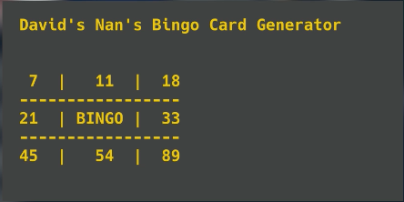
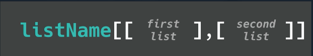

# 👉 Mecca Your Nan Very Happy

Today's challenge is to create a bingo card. Oh yes, because programming's not just for you hip, young cats. 😆

Anyway, your challenge is to enable "gambling for the elderly" (aka Bingo), and you'll achieve it like this:

- Randomly generate a series of number between 0 and 90.
- Allocate each number to a place in a 2D list.
- The numbers should be in numerical order, left to right.
- Numbers should not be repeated.
- The center square should not contain a number. It should contain the word 'BINGO!'.
- When the program is run, the bingo card should be displayed on screen.

Example:



# Take Your List To A New Dimension

Pay close attention, folks, because 2D lists are basically tables.

Tables are two-dimensional data structures where we can store data both vertically and horizontally.

Usually this means that vertical data is used for fields (one category - name, ID, favorite biscuit, etc.) and horizontal data is used for records (all the data for each category).

Behind the scenes, we see a list inside a list. Forget what you know about reading a table with math or geography: 'across the corridor (x-axis) first and then down the stairs (y-axis)'.

Here, we will do row index first and then the column index.


## Remember...

Here's a 1D list. We have the list name as a variable, single equals to set the value, and sqaure brackets to show this is a list. 2D lists are very similar.

```py
my1DList = ["Johnny", 21, "Mac"]
```

Adding The Second Dimension
To add the second dimension, we put lists inside the first list.

👉 Each new list has its own set of square brackets and is separated by a comma. This layout of code is nice to help us visualise the 2D list a a table, but...

```py
my2DList = [ ["Johnny", 21, "Mac"],
["Sian", 19, "PC"],
["Gethin", 17, "PC"] ]
```

...you can also lay it out like this below:

```py
my2DList = [ ["Johnny", 21, "Mac"], ["Sian", 19, "PC"], ["Gethin", 17, "PC"] ]
```

Now, let's `print` this list.

## Printing From a 2D List

Remember, any comments about the code are written in green like this:

```
#these are comments for you, the computer will ignore them
```

### the entire list

👉 We can print an entire 2D list just like we do with a 1D list. However, this will output (print) all of the square brackets, commas, etc.

```py
print(my2DList)

# This will output [['Johnny', 21, 'Mac'], ['Sian', 19, 'PC'], ['Gethin', 17, 'PC']]
```

### a single row

To print a single row, use a single square bracket `[]` in the `print` command. However, you will still get all of those square brackets and commas.

👉 In this example, I'm outputting the first row (index 0) - all of the data about Johnny.

```py
print(my2DList[0])

# This code outputs ['Johnny', 21, 'Mac'].
```

### a single piece of data

The first square bracket references the list, while the second references the item inside that list.

👉 Here are a couple of examples:

```py
my2DList = [ ["Johnny", 21, "Mac"],
["Sian", 19, "PC"],
["Gethin", 17, "PC"] ]
print(my2DList[0][0])

# This code outputs 'Johnny'. It's Johnny's name from list 0 (first square bracket), item 0 (second square bracket)

print(my2DList[1][2])

# This code outputs 'PC'. It's Sian's computing preferene from list 1 (first square bracket), item 2 (second square bracket)
```

## Editing a 2D List

We can edit values in a 2D list in the same way as variables and 1D lists. You just need to change the value to the new row and column index numbers.

👉 In this example, Sian has joined the dark side, so we're updating her computing preference to Linux.

```py
my2DList = [ ["Johnny", 21, "Mac"],
             ["Sian", 19, "PC"],
             ["Gethin", 17, "PC"] ]
my2DList[1][2] = "Linux"
# The line above changes list 1, item 2 from PC to Linux
print(my2DList[1])
# I'm using this line to output list 1 to check that the change has happened correctly.
```
