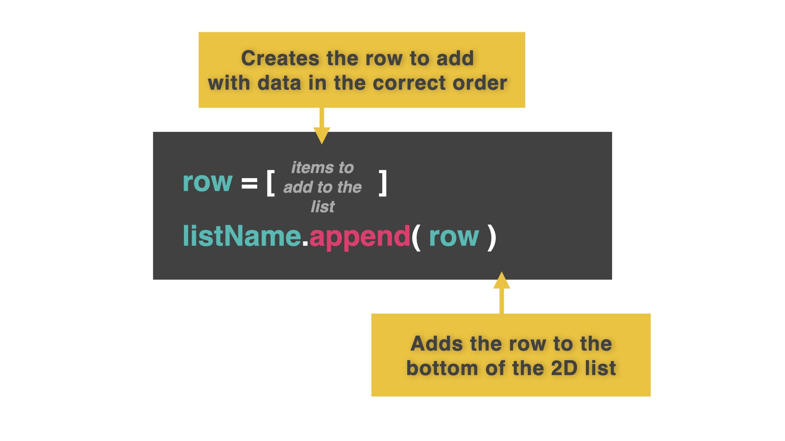

# 👉 Day 44 Challenge

It's time for more bingo! You can reuse your code from day 43, but this time add the following features:

1. Repeatedly ask the user what number comes up next.
2. Check the bingo card to see if the number picked matches one on the card.
3. If the bingo card is all 'X's, then the user has won.

Example:


# 2D Dynamic Lists

Dynamic lists are lists that we populate as we go, getting user input and adding it to the list as we go.

We're combining several techniques here. I've left detailed code comments to help. Remember, comments can be found with `# comment` in green inside the code.

## Loops, append() and break

Here's an example to get some simple user details(name, age, computer preference) and add it to a list as a full row. This list will keep taking input until the user answers 'y' to the 'exit?' question.

Once we collect the user's input in a row, we will `append` the entire row to the list. The columns are maintained and we are keeping the structure of 2D lists.

👉 Let's try it:

```py
listOfShame = []

# Creates an empty list.

while True:

# Starts a never ending loop (until we end it)

name = input("What is your name? ")
age = input("What is your age? ")
pref = input("What is your computer platform? ")

# Get the user input.

row = [name, age, pref]

# Assigns the 3 variables into a single row.

listOfShame.append(row)

# Adds the contents of the row variable at the end of the list

exit = input("Exit? y/n")

# Get user choice to quit, yes or no?

if (exit.strip().lower()[0] == "y"): # strip removes unwanted spaces from the input. lower()[0] makes sure the first character of the input is lower case so it can be compared to 'y'
break # break ends a loop and jumps to the next line of code that is not part of the loop.

print(listOfShame) # Outputs the list. Note this is NOT part of the loop (not indented), it only runs once the loop ends.
```

## Pretty Printing

Man, that `print(listOfShame)` output sure is ug-leeee.

👉 In the code below, I've added a `prettyPrint` subroutine to beautify the output. Remember, we did this before on Day 34.

```py
def prettyPrint():
print()

# Puts a blank row at the top

for row in listOfShame:
#loops to the next row when the end of the current one is reached
print(row) # prints the new row
print()

# prints a blank line between rows

listOfShame = []
while True:
name = input("What is your name? ")
age = input("What is your age? ")
pref = input("What is your computer platform? ")

row = [name, age, pref]
listOfShame.append(row)
exit = input("Exit? y/n")
```
