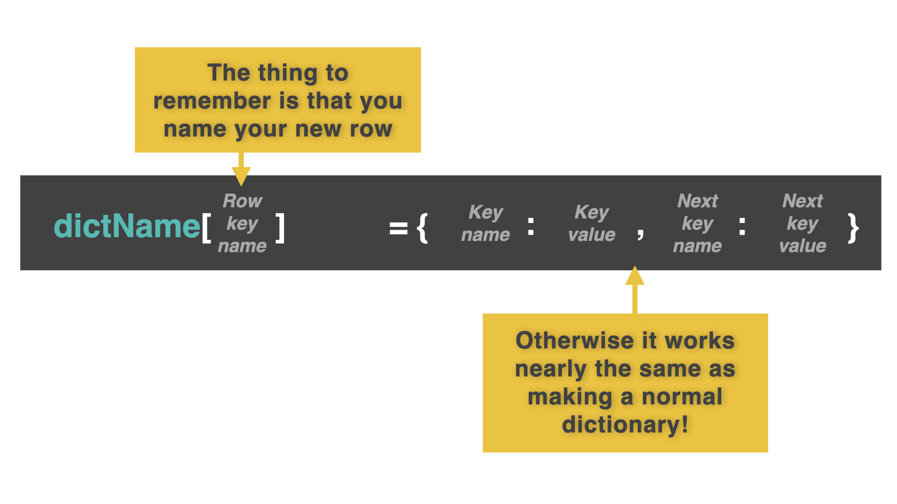
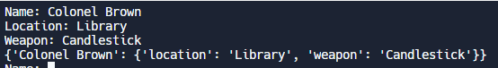
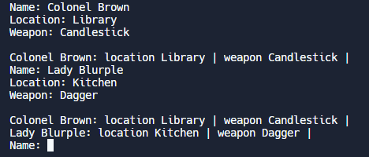

# 👉 Day 46 Challenge

Today, you're going to program a full on Mokébeast Mokédex. Yep, think we're getting away with it so far...

Don't forget, you can reuse your code from Day 42 here.

Your Mokédex should:

1. Store multiple Mokébeasts using a loop.
2. Get user input of the beasts' details.
3. Add the details to a 2D dictionary.
4. Repeat until the user wants to stop.
5. Output the full Mokédex using a prettyPrint() function.

Example:

```
🌟MokeBeast Generator🌟
Input the beast name > PikaWho?
Input the beast element > Air
Input the beast special move > Shaved fish
Input the beast starting HP > 50
Input the beast starting MP > 50
Again? y/n > n
name: PikaWho? | element: Air | special move: Shaved Fish | HP: 50 | MP: 50
```

# 2D Dictionaries

Oh yes, dictionaries are back. That can mean only one thing. It's time to make the lawyers nervous again with the return of Mokébeasts! Yay!

You'll have to wait for your beast fix though.

First, our examples will focus on the completely orignal board game of 'A murder has happened in a room with a weapon and you have to guess who did it'. 😆

Nice. Catchy.

Remember that dictionaries are very similar to lists, except that they store data as key:value pairs. The value is what it's worth and the key is what it is called. The key is used to access the value, and keys are more meaningful than index numbers.

Today we are going to expand our mad dictionary skills into the second dimension.



# Dynamically Adding To A 2D Dictionary

👉 This code dynamically adds to a 2D dictionary by starting with an empty dictionary and using an infinite loop to add user input.

```py
clue = {}
while True:
name = input("Name: ")
location = input("Location: ")
weapon = input("Weapon: ")
clue[name] = {"location": location, "weapon":weapon} #line 7
print(clue)
```

The real magic happens on the 7th line of code. Instead of using `.append()` like we would with a list, we create a new dictionary entry.

The key is the name of the beast, but the value is a whole new dictionary that contains the details of the beast.

Each key:value pair in the dictionary is now a key that accesses a related dictionary.

Look at the output and you can see the new dictionary nested inside the first one.



👉 Can you try this code out with Lady Blurple with a rope in the study?

# Pretty Printing

👉 This example shows you how to add a `prettyPrint()` subroutine that works with a 2D dictionary.

```py
def prettyPrint():
print()

for key, value in clue.items(): # moves along every 'key:subDictionary' pair and outputs the key (the name of the character).
print(key, end=": ")
for subKey, subValue in value.items(): # (nested) `for` loop moves along every subkey and subvalue in each subDictionary.
print(subKey, subValue, end=" | ")
print()
```

When combined with the 2D dictionary code:

```py
clue = {}
def prettyPrint():
print()

for key, value in clue.items(): # moves along every 'key:subDictionary' pair and outputs the key (the name of the character).
print(key, end=": ")
for subKey, subValue in value.items(): # (nested) `for` loop moves along every subkey and subvalue in each subDictionary.
print(subKey, subValue, end=" | ")
print()

while True:
name = input("Name: ")
location = input("Location: ")
weapon = input("Weapon: ")
clue[name] = {"location": location, "weapon":weapon}
prettyPrint()
```

the output looks like this.


