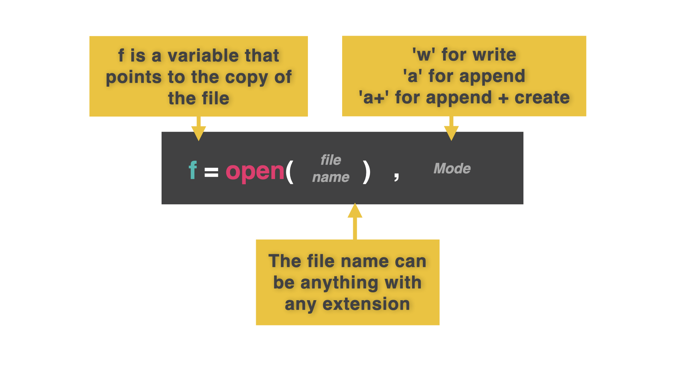
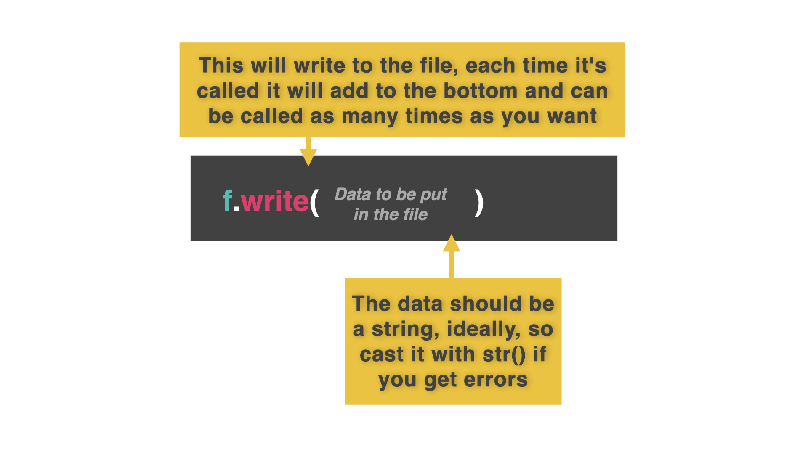
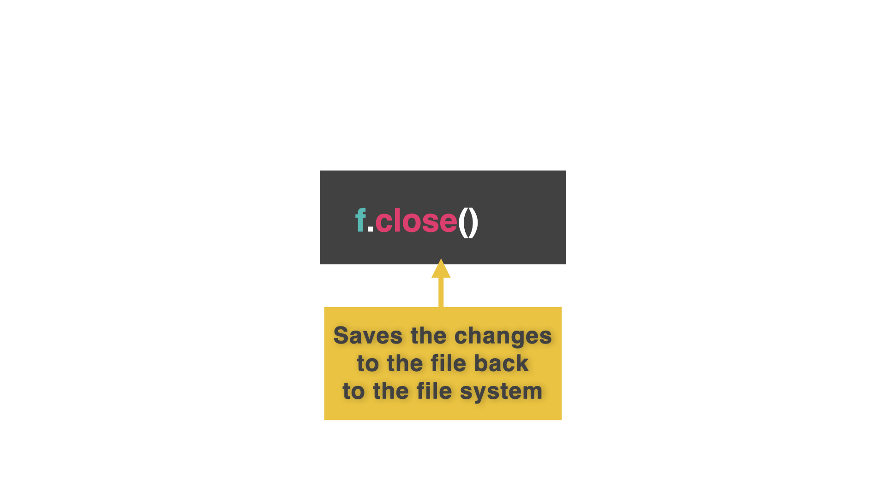
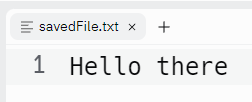
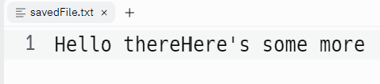
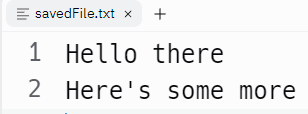

# 👉 Day 48 Challenge

Today's challenge is to create a high score table.

Your program should:

1. Ask the user to input their three letter initials and score (out of about 100,000).
2. Save both those values into a file called 'high.score'.
3. This should use append mode. If the file doesn't exist, it should be created. If it does, the score should be added to the end.
4. Each new entry score should go on a new line as initials space score. Then start a new line for the next entry.
5. Add 2-3 scores for testing in a loop.
6. The loop should ask the user if they've finished entering data and stop if they have.
   🥳 Extra points for getting all the inputs with just one input command and the split function.

Example:

```py
🌟HIGH SCORE TABLE🌟
Input your initials > DJM
Input your score > 89,764
Added to high score table.
Add another? y/n? y
Input your initials > ACY
Input your score > 5,731
Added to high score table.
Add another? y/n? n
```

# File Writing

Our repls don't need to be just one file that contains all of the code and data. We can write data to other files for longer term storage, then access it when we need it.

👉 To do this we're going to use the Files tab in the left hand toolbar. It looks like this:


## Temporary Memory

When we use variables, lists, dictionaries and other data structures in our code, the data inside them are stored in the computer's RAM.

RAM is temporary storage (usually called memory). It's used to hold data and instructions for programs that your computer currently has open.

The problem is, that when a program finishes, or is closed, its data and instructions are removed from the RAM to free up space.

This is why you had to re-input all of your test data for your dynamic list & dictionary programs every time you ran them. The contents of those lists/dictionaries were removed from RAM when the program finished executing.

## Creating A New File

To avoid this incredibly annoying data re-entry task, we are going to get the program to save data into a file. The file will exist in secondary storage (the hard drives on Replit's servers in this case).

👉 Here's how to open a file. This one line of code has three important features:

```py
f = open("savedFile.txt", "w")
```



The variable (`f`): This is needed to allow your program to communicate to the file. Normally this would have a lovely meaningful name. However, you will need to type this variable name lots, and lots, and lots. So short is good. 'f' is short for 'file'.

The file name (the first item in brackets, `"savedFile.txt"`): You MUST code this to match the filename EXACTLY and include the file extension.

The 'w' (second item in brackets): This sets the permissions for the file. 'w' means 'write'. This means that if the file doesn't already exist, the program will create a new blank file with that file name. However, if it does already exist it will be overwritten with a blank file.

## Save Me! Writing Data To The File

👉 The `.write()` command will write the piece of data in brackets into the file. You can use as many of these as you want.

```py
f = open("savedFile.txt", "w")
f.write("Hello there")
```



### Close

👉 However, this data IS STILL IN THE RAM. Nothing gets saved until we close the file using the .close() command.

```py
f = open("savedFile.txt", "w")
f.write("Hello there")
f.close()
```



When you run this code, nothing will appear in the console, but check the files tab on the left.

Gasp! A file has been created.


Click on it to view the contents!



# Saving to Files

👉 Now let's get some input, store it in a variable, and write it to the file.

```
f = open("savedFile.txt", "w")
whatText = input("> ")
f.write(whatText)
f.close()
```

## Preventing Overwrite

We're going to change the file permissions from 'w' to 'a+'.

'a' means append - add to the end of the file.

However, if the file doen't exist, then it will crash.

'a+' means 'add to the end of the file, or create a new one if it doesn't exist'.

👉 Here's the amended code with the change on line 1:

```py
f = open("savedFile.txt", "a+")
whatText = input("> ")
f.write(whatText)
f.close()
```

The problem with this is that it just glues the second input straight on to the first. Like this:



So we need some.......

## New Lines

👉 We can use our old friend, the fString, to format a new line. I've used the \n new line character.

```py
f = open("savedFile.txt", "a+")
whatText = input("> ")
f.write(f"{whatText}\n")
f.close()
```

That's better.



```py
f = open("savedFile.txt", "a+")
whatText = input("> ")
f.write(f"{whatText}\n")
f.close()
```
