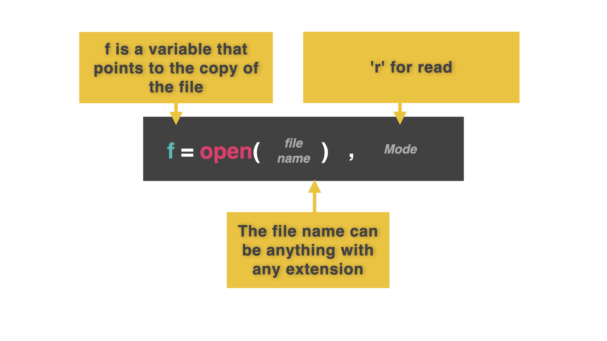
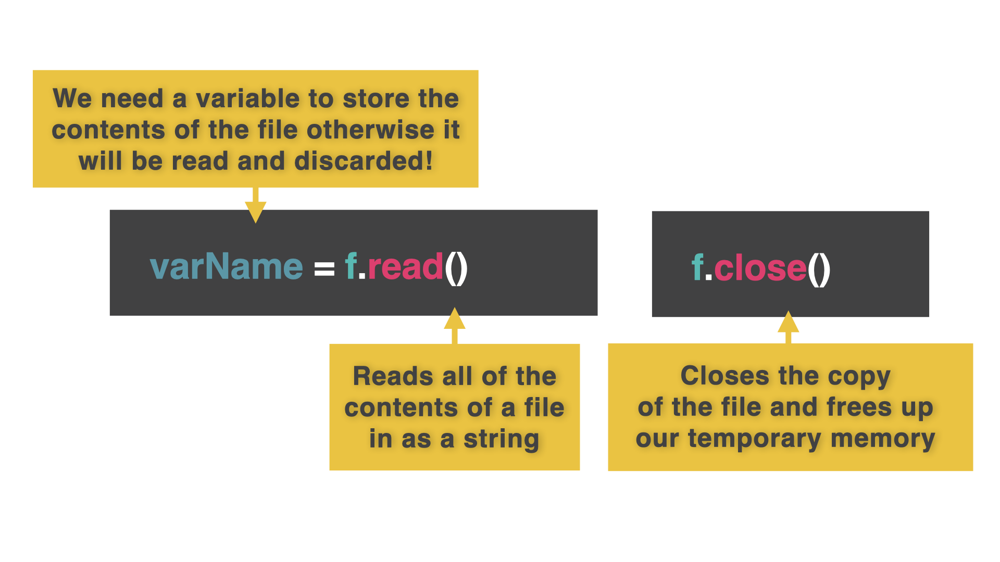
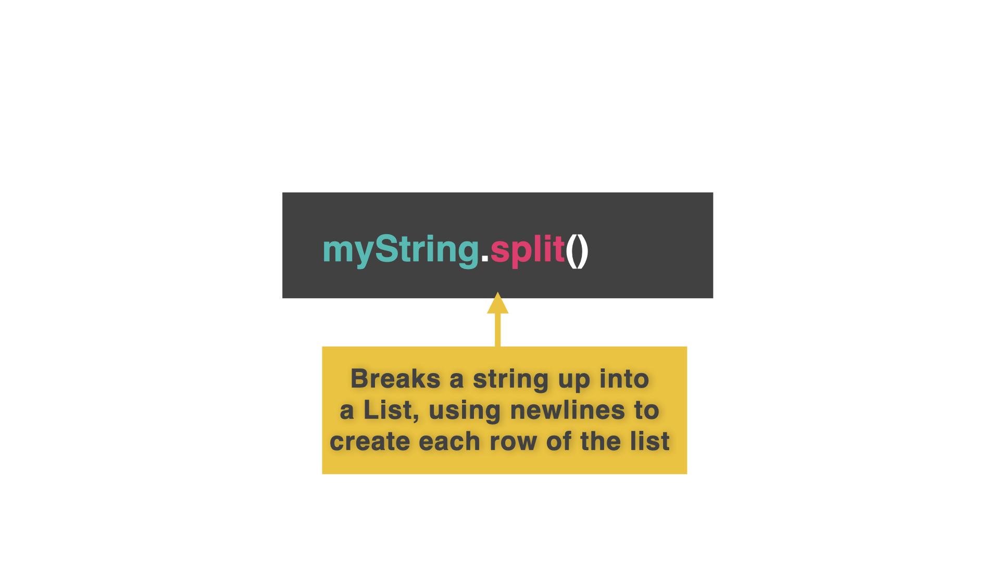
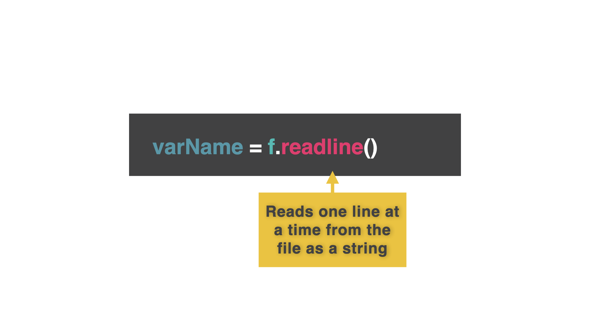

# 👉 Day 49 Challenge

In yesterday's challenge, you created a file called high.score and stored some high scores in it.

We've added a version of that file to this repl.

Your program should:

1. Read in the data from the high.score file.
2. Identify which of those users had the highest score. Automatically! (Not you doing it!)
3. Output the name and score of the winner.
   Example:

```
🌟Current Leader🌟
Analyzing high scores......
Current leader is DJM 898,000
```

# Reading From a File

Once we've got data into a file, wouldn't it be just splendid to load it back into our program to use again?

Yes. Yes is the answer you're looking for.

## Open

👉 The code to load from a file is pretty similar to that for writing. The command is `open` instead of `read`, and the permissions are slightly different.

```py
f = open("filenames.list", "r")
```



## Read and Close

👉 In this example, the permission 'r' means 'read only'. Now we load the contents of the file into a variable using the `read` function. Next, close the file to free up the RAM used to store it.

```py
f = open("filenames.list", "r")
contents = f.read()
f.close()
```



## Print

👉 Finally output the contents of the 'contents' variable to test that it worked.

```py
f = open("filenames.list", "r")
contents = f.read()
f.close()
print(contents)
```

## Split

Bringing everything in in one go is fine, but it would be much more useful to have it as separate items so we can examine it more easily.

👉 To do this, use the `.split()` function in the second to last line. This splits the string into a list of individual elements.

```py
f = open("filenames.list", "r")
contents = f.read()
f.close()
contents = contents.split() #added split here
print(contents)
```



# One At A Time

## Form an orderly queue

Reading all the data at once is fine, reading one item at a time works slightly differently.

It uses the `.readline()` function.

👉 The code below reads one line from the file.

```py
f = open("filenames.list","r")
contents = f.readline()
print(contents)
f.close()
```



## Repeat

To read more than one line, we repeat the command.

👉 The `strip()` function removes the default new line from each print, which would cause an empty line between each line from the file.

```py
f = open("filenames.list","r")
contents = f.readline().strip()
print(contents)
contents = f.readline().strip()
print(contents)
contents = f.readline().strip()
print(contents)
contents = f.readline().strip()
print(contents)
f.close()
```

## Just Use a Loop!

👉 If you're screaming 'LOOP! USE A FREAKING LOOP, MAN!' at the screen right about now.

Your wish is my command.

```py
f = open("filenames.list","r")
while True:
contents = f.readline().strip()

if contents == "":
break
#The last line in the file will be a blank
#We break the loop if the line read is a blank
print(contents)

# Moved the print after the break so it won't output the final blank line.

f.close()
```
