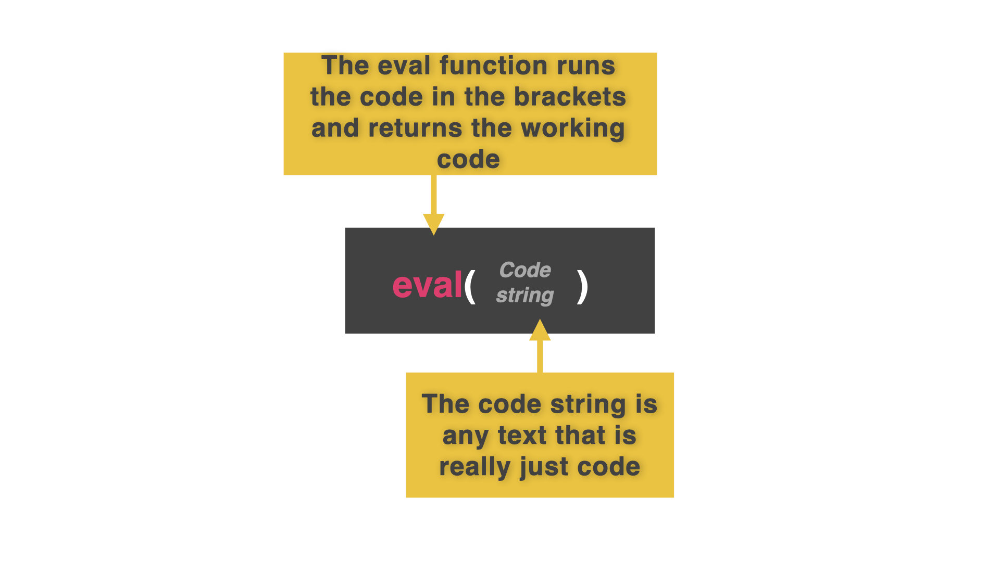

# 👉 Day 51 Challenge

Remember the early days when all this was just lists?

Good! Get back over to Day 45 and grab your to do list code. You'll need it today.

Improve your to do list to add auto-save and auto-load.

That's it. Go get 'em, tiger!

# Save to and Load From Files

There are some things that primary storage in the RAM does better.

For example, it's easy to access, amend, or remove a piece of data held in a list (in the RAM).

Holding data in secondary storage in a file makes this more difficult. Or does it?

With Python, there's more than meets the eye.

👉 The program below lets me add & remove events and dates into a diary system. It adds the name & date of an event to the 2D list. Or it searches for an existing name & date and removes it.

```py
myEvents = []
def prettyPrint():
print()
for row in myEvents:
print(f"{row[0] :^15} {row[1] :^15}")
print()
while True:
menu = input("1: Add, 2: Remove\n")
if menu == "1":
event = input("What event?: ").capitalize()
date = input("What date?: ")
row = [event,date]
myEvents.append(row)
prettyPrint()
else:
criteria = input("What event do you want to remove?: ").title()
for row in myEvents:
if criteria in row:
myEvents.remove(row)
```

Manually saving and loading from this program to a file each time would be a massive faff. Instead, we can set up an auto-save by writing the save code at the end of our infinite loop.

## Auto-Save

👉 At the bottom of the code, we are going to add an autosave just before the loop repeats.

Make sure this new code matches the indent for the while loop, so it is part of the loop.

```py
myEvents = []
def prettyPrint():
print()
for row in myEvents:
print(f"{row[0] :^15} {row[1] :^15}")
print()
while True:
menu = input("1: Add, 2: Remove\n")
if menu == "1":
event = input("What event?: ").capitalize()
date = input("What date?: ")
row = [event,date]
myEvents.append(row)
prettyPrint()
else:
criteria = input("What event do you want to remove?: ").title()
for row in myEvents:
if criteria in row:
myEvents.remove(row)
########### THIS IS THE NEW BIT ########
f = open("calendar.txt", "w") # Permissions set to 'w' because we are deleting the file and replacing it with the whole 2D list every time.
f.write(str(myEvents)) # Need to cast the list to a single string
f.close()
#########################################
```

# Preventing Data Loss

Did you find the problem?

Yep. Every time we run the program, it creates a new, blank `myEvents[]` list which gets written to the file.

This overwrites any events in the file that we saved when we ran the program previously.

To solve this, we set up the program to load any pre-existing data from the file into the `myEvents` list at the very start of the code.

Pay close attention to the `eval()` function. It's the special sauce here...



👉 `eval()` takes the text from the file, converts it into running code, and assigns it to `myEvents[]` as a 2D list. Good, eh?

```py
myEvents = []
####### THIS IS THE NEW BIT ################
f=open("calendar.txt","r") # Only need read permissions here
myEvents = eval(f.read())
f.close()
########################################
def prettyPrint():
print()
for row in myEvents:
print(f"{row[0] :^15} {row[1] :^15}")
print()
while True:
menu = input("1: Add, 2: Remove\n")
if menu == "1":
event = input("What event?: ").capitalize()
date = input("What date?: ")
row = [event,date]
myEvents.append(row)
prettyPrint()
else:
criteria = input("What event do you want to remove?: ").title()
for row in myEvents:
if criteria in row:
myEvents.remove(row)

f = open("calendar.txt", "w")
f.write(str(myEvents))
f.close()
```
