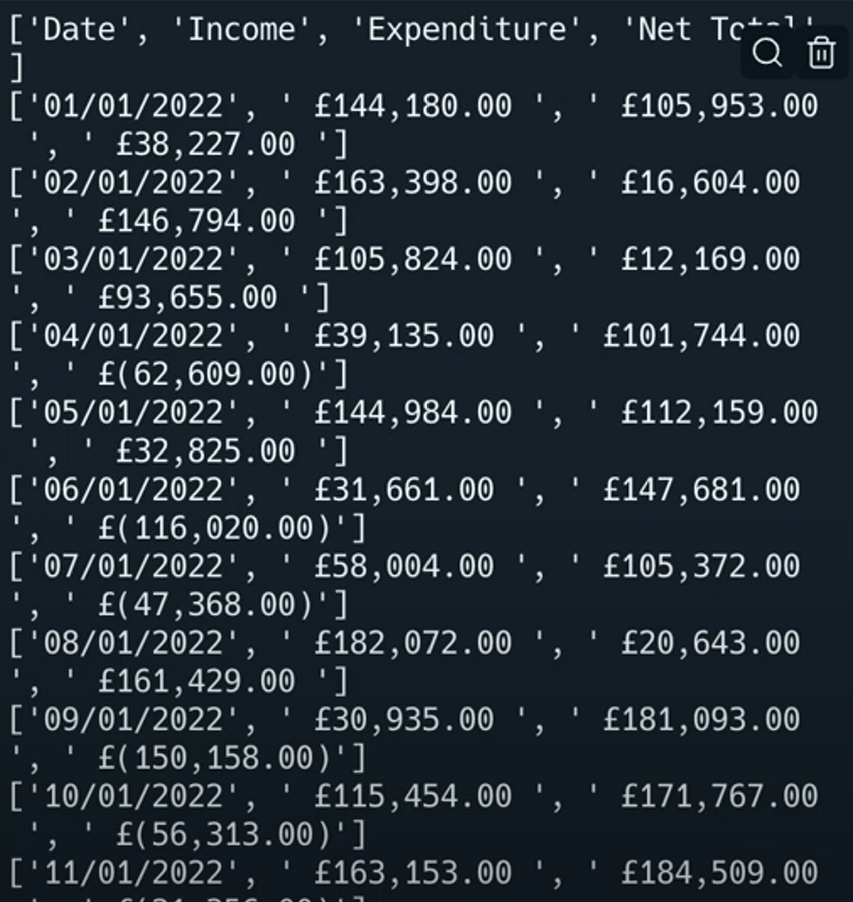
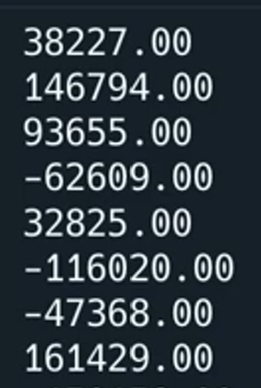

# 👉 Day 54 Challenge

I've given you a CSV file called 'Day54Totals.csv' (look at your file tree) that contains multiple pieces of data in the fields 'cost' and 'quantity' of items sold. How much money did this shop earn in a day?

Your program should:

1. Read the CSV file in.
2. Multiply the cost by the quantity.
3. Add it all together to calculate how much money the shop made in a day.

Example:

```
🌟Shop $$ Tracker🌟
Your shop took £592 pounds today.
```

# Comma-Separated Values

CSV files are a way of storing a spreadsheet as a text file. Every value in the file is separated by a comma.

Hence the name...

Look, it's basically a spreadsheet.

## Opening A CSV File

Fortunately, CSV files are so common that Python already has built-in libraries for working with them.

👉 The csv file 'January.csv' has been added for you. Let's see what happens:

```py
import csv # Imports the csv library
with open("January.csv") as file: # Opens the csv file
reader = csv.reader(file) # reads the contents of the csv file into the 'reader' variable
line = 0
for row in reader: # loop to output each row in the 'reader' variable one at a time.
print (row)
```

This works, but the output isn't very pretty. And we like pretty.


## Make it Beautiful!

👉 Let's use `join`. It allows us combine lists in a more interesting way.

```py
import csv
with open("January.csv") as file:
reader = csv.reader(file)
line = 0
for row in reader:
print (", ".join(row)) # adds a comma and space and then joins data, you could try joining with tabs too with `\t`
```

## Filter the Output

👉 The trick is to treat the CSV like a dictionary, using the `csv.DictReader()`function. In the code below, I've filtered it so that it only shows the net total from each day.

```py
import csv # Imports the csv library
with open("January.csv") as file:
reader = csv.DictReader(file) # Treats the file as a dictionary
line = 0
for row in reader:
print (row["Net Total"])
```



👉 Now let's see if we can add the net totals from each day to create a total. Note that I've cast the data as a float because our library will treat it as text.

```py
import csv # Imports the csv library
with open("January.csv") as file:
reader = csv.DictReader(file) # Treats the file as a dictionary
total = 0
for row in reader:
print (row["Net Total"])
total += float(row["Net Total"]) # Keeps a running total
print(f"Total: {total}") #Outputs
```
