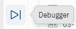
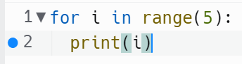
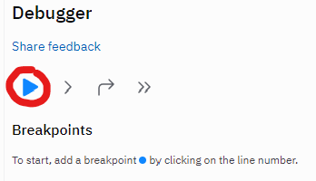
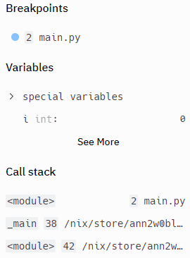

# Debugging

It's day 58, and our code is getting quite complicated.

The debugger helps us keep track of what's going on without having to print all the time.

We can slow down the execution of the program, keep track of what's stored in variables and lists at any given point, and set breakpoints on any lines that need special attention.

Look at your side pane to find this icon.



That's the debugger!

👉 Here's a simple program that we will use with the debugger.

```py
for i in range(5):
print(i)
```

Breakpoints
👉 We start by setting a breakpoint by clicking on the left of the line number to make a blue dot appear. This dot means 'pause here'.

I'm setting the breakpoint on the `print(i)` line:



👉Run the code using the 'play' icon in the debug pane:



👉The program will pause at the breakpoint. You'll be able to see lots of info about what's stored in your variables, etc. in the debug pane.



👉 The other icons in the debug pane let us run through the code in different ways. In order, they are:

- Next step: run the next line, then pause
- skip step
- next breakpoint - run to next breakpoint, then pause


## More Debugging

👉 Here's a simple random choice with a menu program. Let's see how breakpoints are helpful here:

```py
import random
colors = ["Red","Orange", "Yellow", "Green", "Teal", "Blue", "Purple", "Violet"]
while True:
menu = input("1:Color or 2: exit?")
if menu =="1":
print(random.choice(colors))
else:
break
```

👉 Try putting a breakpoint on the `if` line. When the program pauses, step through the `if` statement.

Then go to the next breakpoint to see how you can speed up and slow down code execution with good breakpoint placement.
