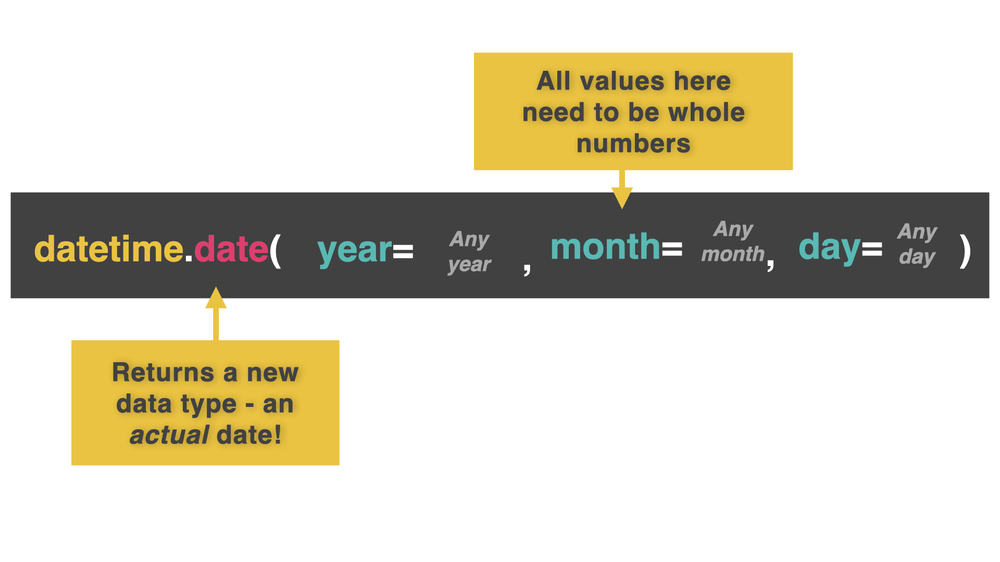
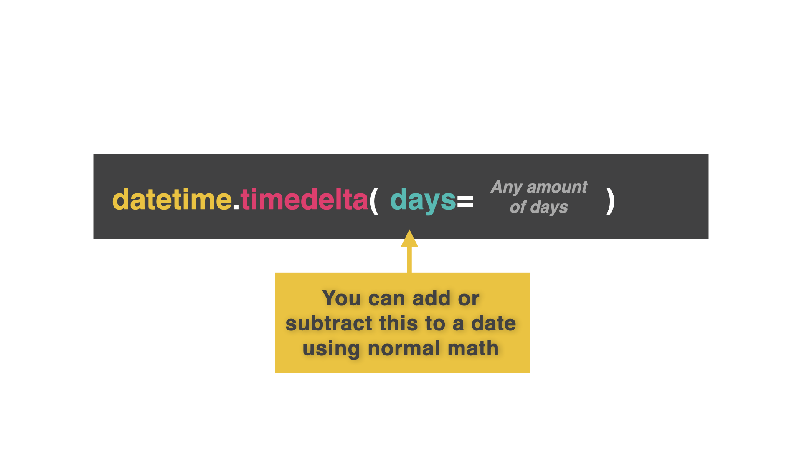

# The Magic of Time....

On day 60, we're going to learn about time (not time travel). Sorry to disappoint.

This can be quite a complicated thing, because we humans don't have nice standardized time. Instead we have:

- 24 hour clocks
- AM and PM
- Months of differing lengths
- Leap years
- Leap seconds

And all sorts of oddities in our temporal framework.

## Unix Epoch

👉 Your computer (and all of the other ones) uses something called the Unix epoch to measure time.

It counts the amount of seconds elapsed since Jan 1st, 1970 (even when the power's off - there's a small battery on your motherboard that keeps this function running).

Then, it turns this into a meaningful format for you, you illogical human.

## datetime

To use the Unix epoch, we first need to import the datetime library

```py
import datetime
```

👉 Now I'm going to insert the date and assign it to a variable.

```py
import datetime
myDate = datetime.date(year=2022, month=12, day= 7)
print(myDate)

# This code outputs '2022-12-07'
```



You HAVE to use the year -> month -> day format for your arguments. So Brits & Americans, put down your calendars and go find something else to argue about...

The reason for this format is that the elements get smaller (and less important) sequentially from left to right. This makes sorting much easier.

## Asking For A Date

👉 Let's use datetime to automatically get today's date.

```py
import datetime
today = datetime.date.today()
print(today)

# This code outputs the current date from your computer's clock.
```

Hmmm, remember when we were creating to-do lists and we had to manually input the date......

## Getting Date Input

👉 The easiest way to do this is to ask the user for day, month, and year in separate values.

```py
import datetime
day = int(input("Day: ")) # Get all input as numbers. We're not at text input for months yet.
month = int(input("Month: "))
year = int(input("Year: "))
date = datetime.date(year, month, day)
print(date)
```

# Delta Force

A common task in programs is to work out the difference between two dates, for example to calculate someone's age.

To do this, we use a time delta.

Delta is a computer science term that means the difference between two things.

A time delta is a difference in time. The time delta between when you were born and now is increasing all the time as you age.

👉 Here's some code that calculates a time delta between today and two weeks today to see what the date will be in two weeks.

```py
import datetime
today = datetime.date.today() # Today's date
difference = datetime.timedelta(days=14) # The difference I want
newDate = today + difference # Add today to the delta difference to see the date in 14 days time.
print(newDate)
```



## If Statements With Dates

Provided you've formatted the date correctly, you can use the `>` `==` and `<` comparison operators just like you can with integers.

👉 I can use this to tell me if I should be on vacation or not!

```py
import datetime
today = datetime.date.today() # Today's date
holiday = datetime.date(year = 2022, month = 10, day = 30) # The date of my holiday
if holiday > today: # If my holiday is in the future
print("Coming soon")
elif holiday < today: #If my holiday date has passed
print("Hope you enjoyed it")
else: # If my holiday date is today
print("HOLIDAY TIME!")
```

# 👉 Day 60 Challenge

Today's challenge is an events countdown timer.

Your program should:

1. Austomatically work out today's date.
2. Prompt the user to input the name and date of their event (year, month and day).
3. Work out the number of days until the event and output it.
4. If the event is happening today, insert some party emojis.
5. If the event was in the past, sad face emojis and tell the user how many days ago it was.

Example:

```
🌟Event Countdown Timer🌟
Input the event > Nan's 100th birthday
Input the year > 2022
Input the month > 10
Input the day > 16
🎉🎉Nan's 100th birthday is today! 🎉🎉
```
