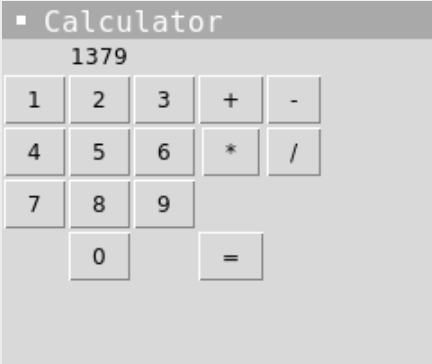

Your challenge is to create a simple GUI calculator.

Your program should:

1. Have buttons for the numbers 0 to 9, plus, minus, multiply, divide and equals.
2. The user should be able to press buttons to create their calculation.
3. It should output the correct result when they press equals.

Example:

